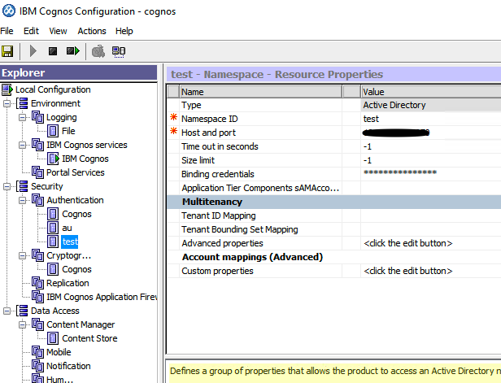
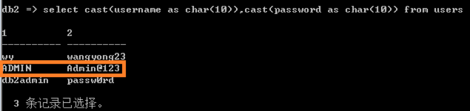
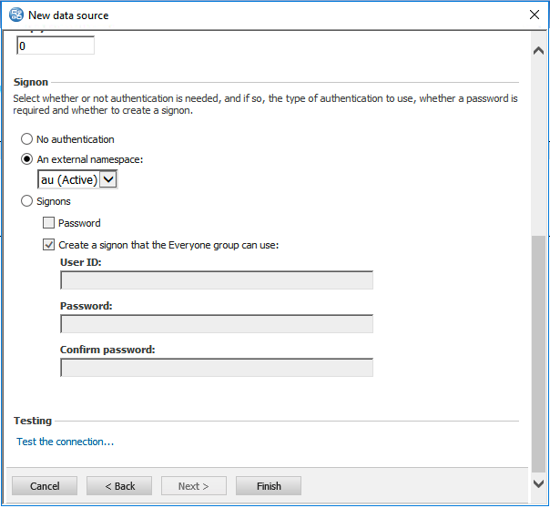

## Integration with Cognos 10.X

### Install Kyligence ODBC Driver

Please refer to this guide [Kyligence ODBC Driver Tutorial](../driver/kyligence-odbc.en.md) for installation.

The Kyligence ODBC driver needs to be installed in the machine or virtual environment where your Cognos Server is installed.

### Create a Data Source in Cognos

Depending on your business scenario, you may need to create a new project or simply use an existing project to create the data source for KAP. In the example, we will start with a new project. 

1. Create a new project.

2. Use `Metadata Wizard` create a new `Data Source`.

3. In the `New Data Source Wizard`, first fill in data source name, this could be any name you prefer.

4. Choose `ODBC` as the connection type. For Isolation Level, choose `Use the default object gateway`  

5. In ODBC data source, fill in the DSN name that you created in the previous step. Check `Unicode ODBC`. For Signon `choose no authorization`. Then Click `Test the connection`.

If everything set up properly, test the connection will finish successfully.

Now you have the data source created.

6. Click `Next`, you may test the connection in the`Metadata Wizard`.

### Cognos & KAP ACL Integration

In order to reflect KAP Access Control in Cognos, it is necessary to allow Cognos users to query KAP with their corresponding KAP credentials. This following will introduce how to integrate the access permission of Cognos with KAP by using a custom Java example, on the assumption that Cognos's authentication has been configured. For the details, please refer to the AuthenticationProvider document corresponding to Cognos SDK. The following figure is a typical Cognos external authentication space using Java example:

In the database of Cognos authentication, add KAP's usename and password:

Next, create a Cognos data source. You may refer to the 1st - 4th steps above. And select `An external namespace` in the 5th step as shown in below figure:

Click `Test the connection…` . If everything is set up properly, the connection testing will finish successfully, which means that Cognos has been connected to KAP's server through KAP's ODBC. 

###Test Connection

Next, you may test the connection with tables.

Click next to finish metadata wizard.

Now, this new data source has been imported into the project. You can right click on a table to test the connection.

On the pop-up window, click `test sample` to test connection against this table. If the connection is correct, test results may return as shown in the screenshot below.

### Publish Package

In the project viewer, right click on Packages->Create ->Package to publish data source as a package.

Name the package.

Choose the table and column that you want to publish.

Leave the functions lists as default.

Now you have successfully created a new package. Next, open the `publish package wizard`. 

You may leave the rest of the below settings as default, and finish the wizard.

Now you have published the package.

###Create a Simple Chart

Now you can create a simple chart with newly the published package.

Go to your IBM Cognos Web. Launch Report Studio.

Choose the package you just created in the previous step.

In Cognos Report Studio, click `Create New`.

Click `Chart` to create a new chart with the new package.

Choose a chart type.

Drag PRICE from Kylin_sales table to Measure, and drag LSTG_FORMAT_NAME to series. 

Then click the `Play` button on the top menu to run this report. 

Now you have successfully created a new chart with KAP as the data source.

### 

