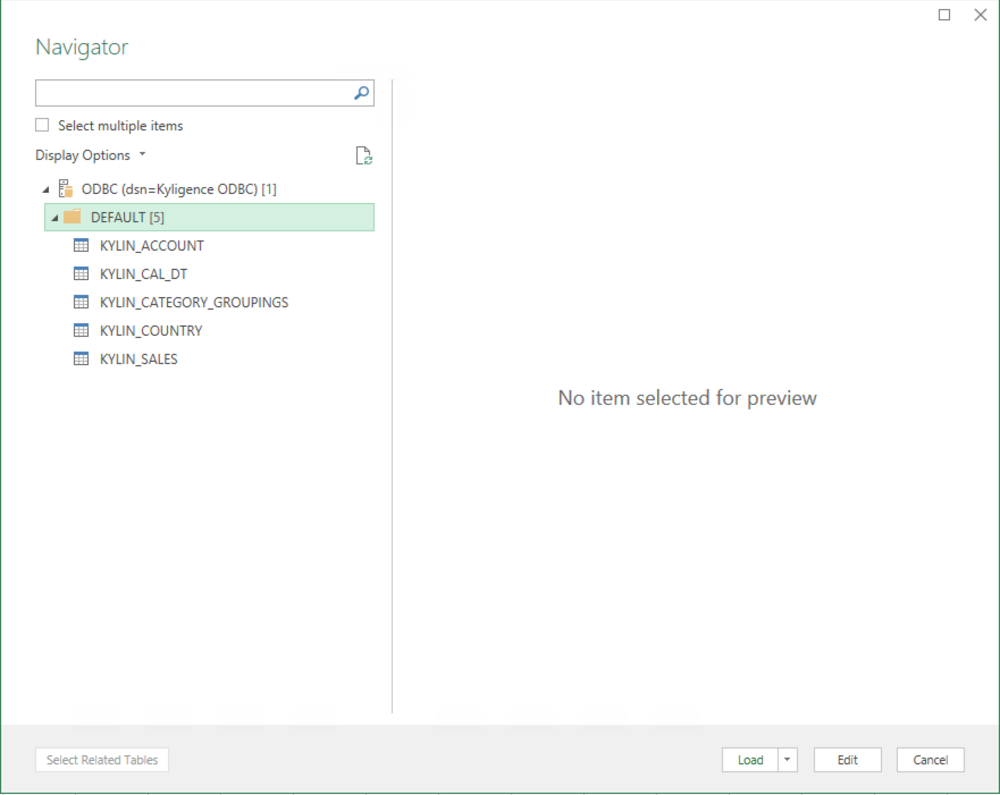
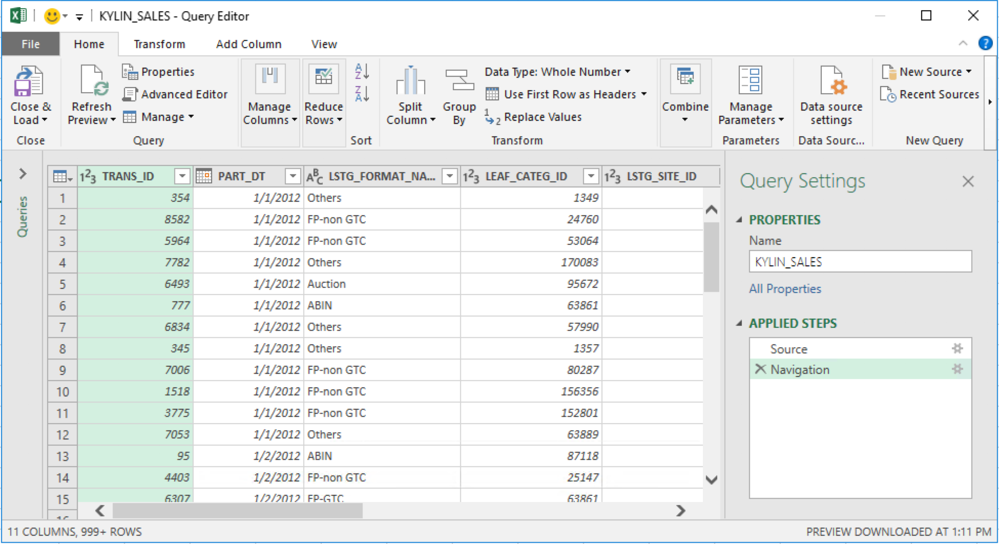

## Excel Integration

Microsoft Excel is one of the most famous data tools on Windows platform, and has plenty of data analyzing functions. With Power Query installed as plug-in, Excel can easily read data from ODBC data source and fill spreadsheets. 

### Install Kyligence ODBC Driver
For the installation information, please refer to [Kyligence ODBC Driver tutorial](../driver/kyligence-odbc.en.md).

### Connect Excel to KAP
1. Run Excel 2016(with built-in power query), switch to `Get Data` fast tab, click `From Other Sources` dropdown list, and select `From ODBC` item.
   

2. You will see`From ODBC`dialog, you can choose DSN`Kyligence ODBC` (Note：DSN referring to a specific data source. If you want to change data source, please rebuild connection with Kyligence ODBC driver); or choose`Advanced options`, and type Database Connection String of KAP Server in the `Connection String` textbox. Optionally you can type a SQL statement in `SQL statement` textbox. Click `OK`, result set will run to your spreadsheet now.

   

   

> Note: In order to simplify the Database Connection String, DSN is recommended, which can shorten the Connection String like `DSN=[YOUR_DSN_NAME]`. Details about DSN, refer to [https://support.microsoft.com/en-us/kb/305599](https://support.microsoft.com/en-us/kb/305599).

3. If you didn’t input the SQL statement in last step, Power Query will list all tables in the project, which means you can load data from the whole table. But, since KAP cannot query on raw data currently, this function may be limited.
   
4. Hold on for a while, the data is lying in Excel now.
   
5. If you want to sync data with KAP Server, just right click the data source in right panel, and select `Refresh`, then you’ll see the latest data.
