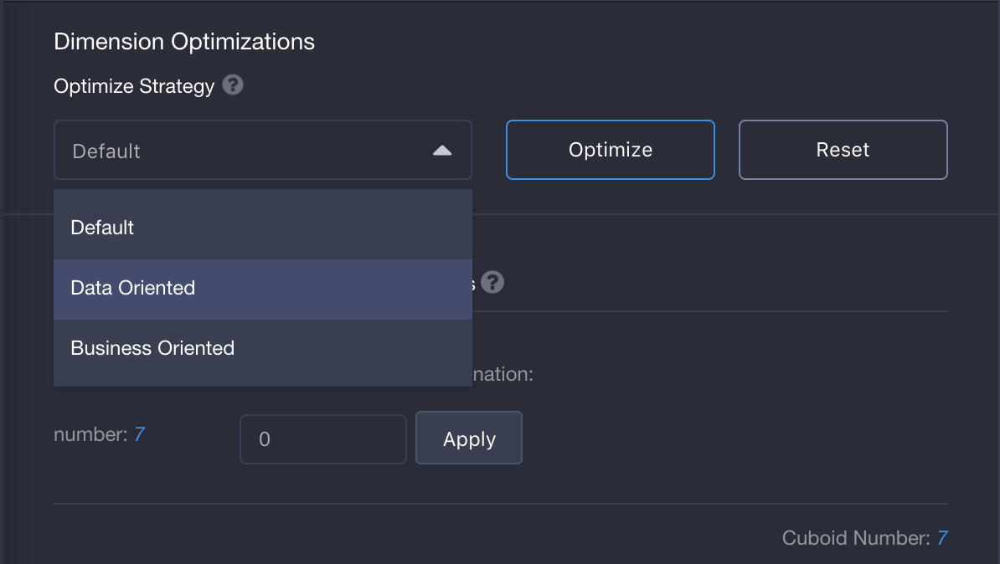
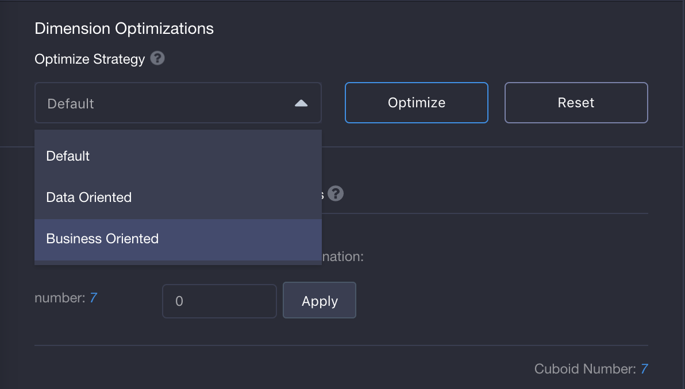
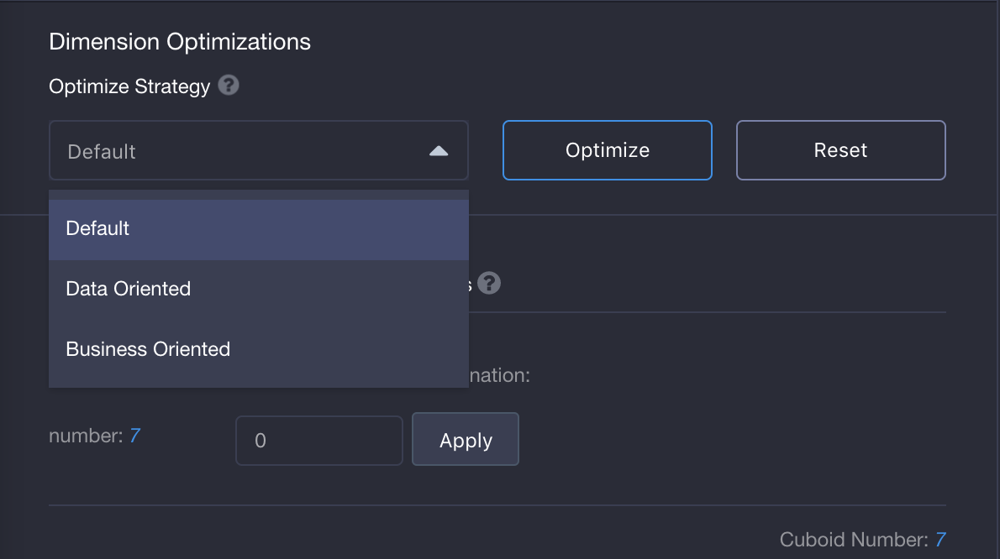

## Cube Optimizer

Start from V2.5, KAP provides a ***multi-preference based Cube Optimizer*** to suggest cube designs, which helps reduce cube expansion and improve ***Query/Build*** performance.

### Introduction

According to the best pratices of Cube tuning, Optimizer analyzes statistics of source data and SQL patterns, and suggests a optimized Cube design, which includes:

- ***Optimization Strategy***: 

  - Data Oriented: Optimizer would mainly digest source data feature to suggest one aggregate group, which optimizes all dimensions from a model. Cubes which follows data-oriented strategy are suitable to serve flexible queries.

    

  - Business Oriented: Optimizer would only digest SQL patterns input in **Optimizer Inputs** to suggest multiple aggregate groups consisting of mandatory dimensions. Cubes which follows business-oriented strategy are designed to answer known queries.

    

  - Default: If you do not specify any strategy, KAP will suggest the aggregation groups and Rowkeys based on the contents in **Optimizer Inputs**.

    

- ***Dimensions***: dimension and the type of dimension, such as ***Normal*** or ***Derived.***
- ***Measures***: suggest common aggregation mostly in entered SQL patterns as measures.
- ***Aggregation Groups***: Optimizer will suggest select rules for each group, such as Joint, Hierarchy, Max dimension combination(MDX) etc.
- ***Rowkey***: Optimizer will suggest order and configuration for each Rowkeys, such as Encoding.

In order to achieve accurate suggestion, Optimizer need following items as input:

- Preference: help you optimize cube exactly based on your query scenario

  > Note: when you choose one preference, the following input content may be the required condition to use cube optimizer later

- Model check: Model check must be completed before Optimize a cube, and the result is required input for Optimizer

- SQL patterns: Some history or target SQL statements, which guides the suggestion for Measures, Aggregation Groups and Rowkeys

### Steps

Step 1, To finish model check. Skip if already passed. To get more about model check, please click [here](../model_check.en.md).

Step 2, To create a cube with this model, and click "Collect SQL patterns" under "Cube Info" tabpage, and paste your SQL statements. For multiple SQLs, use ';' for seperation.

Step 3, Click "+ Dimensions" button on "Dimensions" tabpage and then the dimension window will pop up. You can select ***SQL output*** to get suggested dimensions from ***SQL patterns***, or select dimensions manually. All default dinmension type(normal/derived) are suggested by Cube Optimzier. 

Step 4, Click "Optimize" button under "Dimension optimizations" section, Aggregation groups will be filled with suggested rules, such as Mandatory, Hierarchy and Joint. Besides, configuration and order of Rowkeys will also be updated as suggestion.

Step 5, Click "SQL Output" button under "Measures" tabpage, Optimizer will fill suggest measures from SQL patterns.

Step 6, According to business requirements, users are able to make any adjustment to dimension, measures, aggregation groups, rowkeys, measures and so on. And save it at last.

