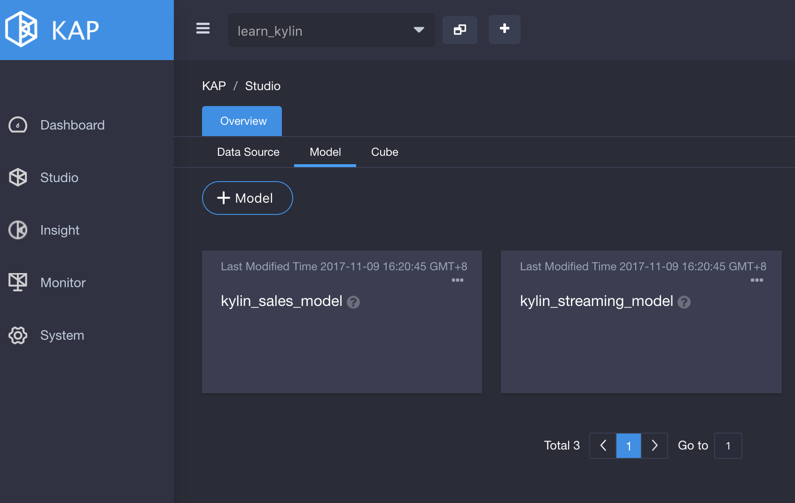
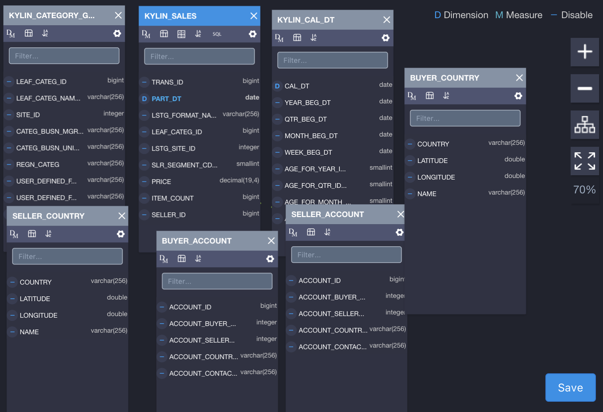
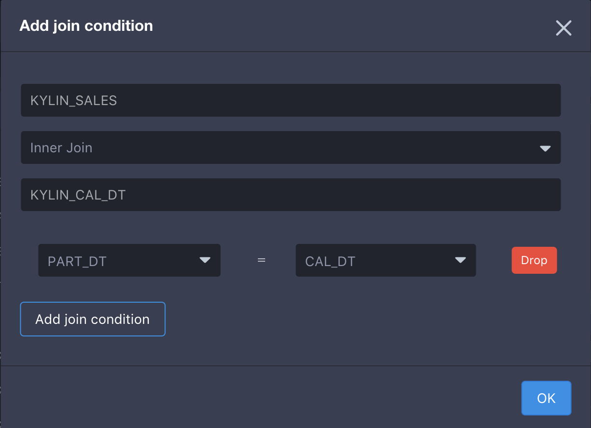
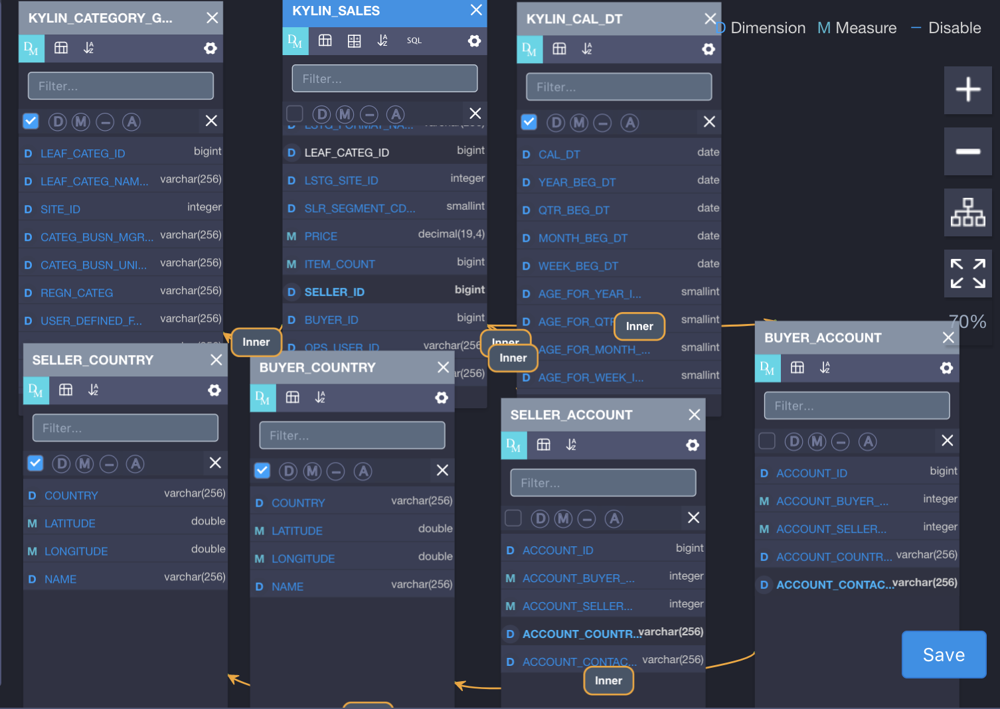
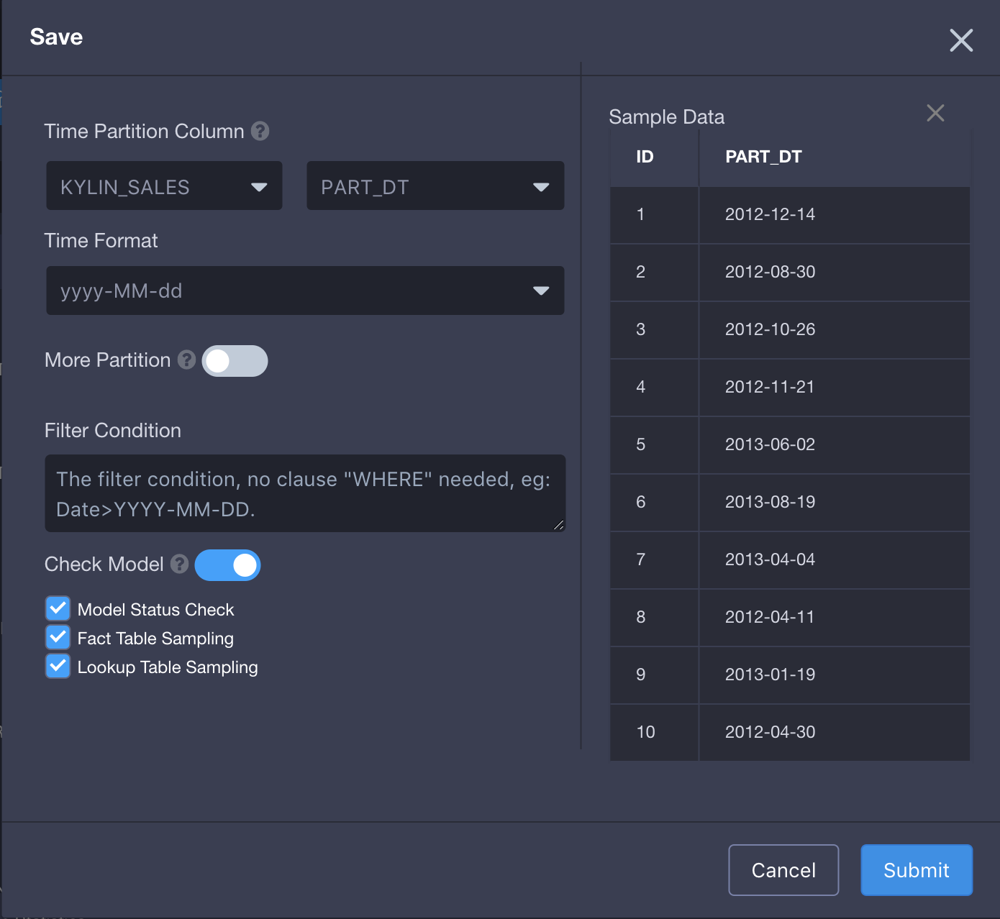
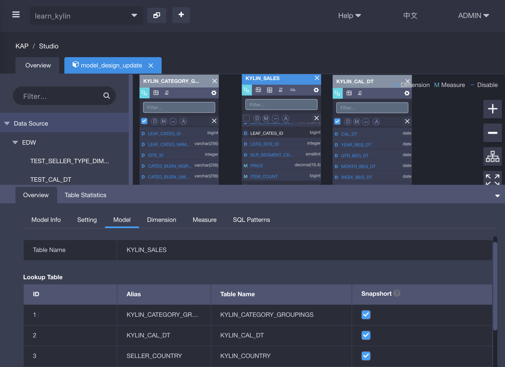
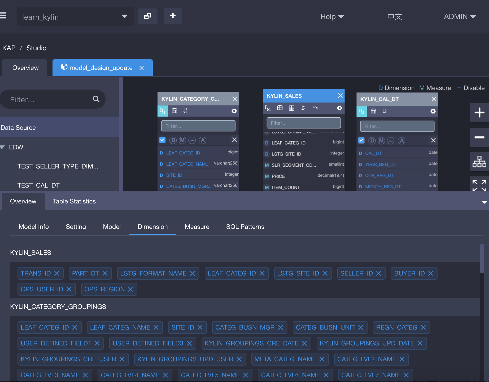
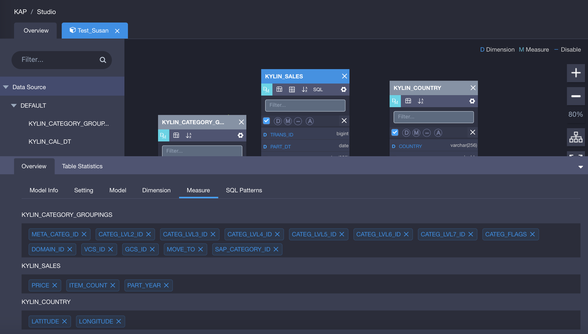

## Data Model

Data model is created based on data source. In this article, we take the dataset coming with KAP as example. There are 1 fact table and 6 lookup tables in the data model, connected by foreign keys. In fact, not all columns on the tables are required for analysis, so we only put the required ones into data model. Then we set set these columns as dimensions or measures according to the analyst's scenarios.

### Create Data Model

**Step 1**: Open KAP Web UI, select project `Learn_kylin` in project list located at upper left corner. Then create a new data model on `Model` page.

**Step 2**: Select the fact table and lookup table for the model (For the storage of lookup table, please refer to [Instructions and Tips](instructions-and-tips) at the end of this article). The steps are as below:

1. To build the following snowflake schema, from the left source table list, drag source tables to the canvas of model designer (in the center of page). First, drag   `KYLIN_SALES` table to the canvas;
2. Click the setting icon at the upper right corner to toggle `kylin_sales` 's table type to fact table;
3. Select and drag the following lookup tables to the canvas (`KYLIN_CAL_DT`, `KYLIN_CATEGORY_GROUPINGS`,`KYLIN_ACCOUNT`, `KYLIN_COUNTRY`); Where, drag `KYLIN_ACCOUNT` twice and change their names to `SELLER_ACCOUNT` and `BUYER_ACCOUNT` respectively, and drag`KYLIN_COUNTRY` twice and change their names to `SELLER_ACCOUNT` and `BUYER_ACCOUNT` respectively。

**Step 3**: Set dimensions and measures (DM). Since KAP V2.5.4, you may not only make single selection or batch selections for dimensions and measures, but also use suggestions by the system. In this example, we use the dimensions and measures suggested by the system. The steps are as below. For more operations, please refer to [Instructions and Tips](instructions-and-tips) at the end of this article. 

1. Click the icon `DM` at the upper left corner to expand DM setting toolbar. In this tooltar, the icon `D` is for dimension, `M` for measure, `—`  for disable and `A` indicates dimensions and measures suggested by KAP.
2. Select the checkbox at the rightmost of the toolbar to check all columns, and set them as dimension `D` or measure `M`, or select `A` to use suggested dimensions and measures. You may also select and set the columns one by one. In this example, we select the checkbox and choose `A` .

**Step 4**: Set table join conditions as below. In KAP V2.4 and above, dragging one dimension and dropping it to a target lookup table can setup join condition among tables. For instance, to set up join condition as “KYLIN_SALES *Inner Join* KYLIN\_CAL\_DT on KYLIN\_SALES.PART_DT=KYLIN\_CAL\_DT.CAL\_DT”, you should drag `PART_DT` from `KYLIN_SALES` to the table`KYLIN_CAL_DT`, the following window will pop up.

Set up the following join conditions by referring to the above method:

1. KYLIN_SALES *Inner Join* KYLIN\_CAL\_DT 

   Connect Condition：

   DEFAULT.KYLIN\_SALES.PART_DT = DEFAULT.KYLIN\_CAL\_DT.CAL\_DT

2. KYLIN_SALES *Inner Join* KYLIN\_CATEGORY_GROUPINGS 

   Connect Condition: 

   KYLIN_SALES.LEAF_CATEG_ID=KYLIN\_CATEGORY\_GROUPINGS.LEAF_CATEG_ID

   KYLIN_SALES.LSTG_SITE_ID=KYLIN\_CATEGORY\_GROUPINGS.SITE_ID 

3. KYLIN_SALES *Inner Join* BUYER_ACCOUNT (alias of KYLIN_ACCOUNT)

   Connect Condition: 

   KYLIN_SALES.BUYER_ID=BUYER_ACCOUNT.ACCOUNT_ID 

4. KYLIN_SALES *Inner Join* SELLER_ACCOUNT (alias of KYLIN_ACCOUNT) 

   Connect Condition: 

   KYLIN_SALES.SELLER_ID=SELLER_ACCOUNT.ACCOUNT_ID 

5. BUYER_ACCOUNT (alias of KYLIN_ACCOUNT) *Inner Join* BUYER_COUNTRY(alias of KYLIN\_COUNTRY) 

   Connect Condition: 

   BUYER_ACCOUNT.ACCOUNT_COUNTRY=BUYER_COUNTRY.COUNTRY 

6. SELLER_ACCOUNT (alias of KYLIN_ACCOUNT) *Inner Join* SELLER_COUNTRY(alias of KYLIN\_COUNTRY)

   Connect Condition: 

   SELLER_ACCOUNT.ACCOUNT_COUNTRY=SELLER_COUNTRY.COUNTRY

The result is shown in the following figure (if you click "inner" as join type, it will show you details of this join condition).

**Step 5**: Click `Save` button, and then select the time partition column. New data comes to Hive through ETL every day in general, based on which Cube is built incrementally. Let's select column `DEFAULT.KYLIN_SALES.PART_DT` as partition column and specify the date format as `yyyy-MM-dd`.

Finally, click the button `Submit`, and the data model is created.

### Instructions and Tips

#### Lookup Table Storage

If you want to set the storage of lookup table, click ` Overview` and then click `Model`. The Lookup table and Fact table will appear. By default, when the size of lookup table is less than 300M, the table will be stored as snapshot, so as to improve the query efficiency; when it is greater than 300M,  KAP do not support to store it as snapshot. At this time, if you still want to make it available, you need to change the corresponding configuration in kylin.properties.【】

#### Select Dimensions and Measures

After setting table join conditions, you may continue selecting dimensions and measures. Click `Overview` to show `Dimension` and `Measure` tabs. Click X followed by the column name to delete the corresponding dimension and measure you do not need. Usually, Date column is selected as filter condition, so it's required. Other columns such as `Category` and `Seller ID` are also selected as dimensions. 

Select measures from fact table according to business requirement. For instance, `PRICE` is used to measure sales price, `ITEM_COUNT` is used to measure sales amount, etc. Same as dimension summary, measures summary can be view if you click the "measure" tab besides the dimension overview.

