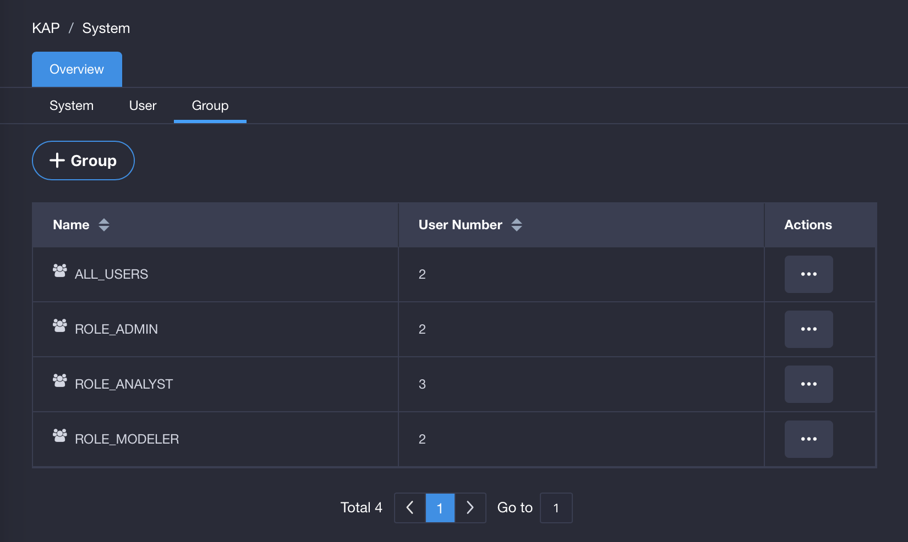
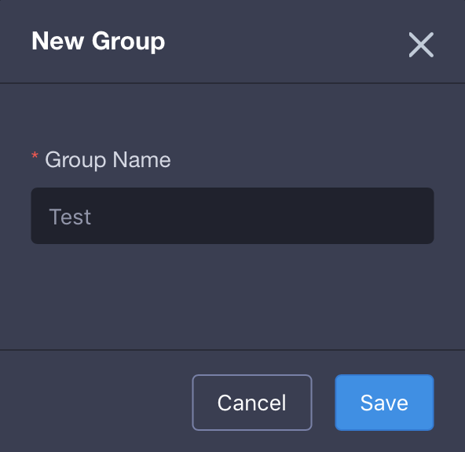
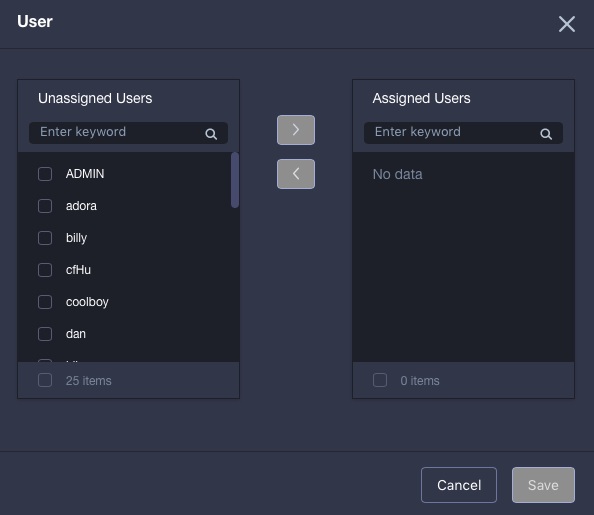
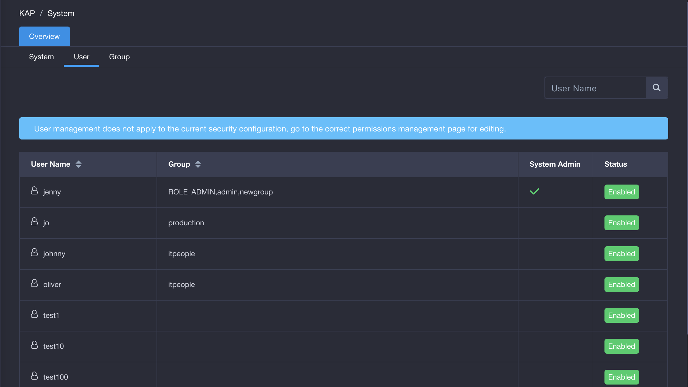

## User Group Management

This section provides an overview of what a user group is and how a user group can be managed. 

###About User Group

User group is a collection of users. Users in a user group share the same permissions through the group. In a large organization/enterprise, user's permissions are usually granted on a user group basis, so that users who have the same permissions can be set in bulk. This will greatly improve the productivity in such scenario.

The group All Users is a default user group. A user will enter into this group once being created. That means the group All Users includes all users created. This group cannot be modified or deleted. The system administrator can bulk add or delete users to/from a group except for All Users, and add a user to multiple groups except for All Users. The name of a user group shall be unique in KAP.

### About User Group Permissions

The system administrator can grant the project-level/row-level/table-level/column-level access permissions to a user group. When a user group has been granted the project-level/row-level/table-level/column-level permissions, users in this group will inherit the corresponding permissions from the group.

When a user group and a user in the user group have been set the project-level access permissions at the same time, the user's permission will take the highest permission. For example, if User A is granted *QUERY* permission in a project, while the user group which User A belongs to is set *MANAGEMENT* permission in this project, then User A has *MANAGEMENT* permission in this project.

If row-level/table-level/column-level access permissions of a user group have been revoked, users in this group will lost the corresponding permissions. If a user group is forbidden to access a table/row/column, while a user in this group is allowed to access the table/row/column, then the user is prohibited to access the table/row/column, and vice versa.

The permissions set for user and user group the user belongs to will work for the user simultaneously. For instance, a user group is forbidden to access Table A, a user in this group is prohibited to access Table B, then the user is not allowed to access Table A and Table B.

When a user belongs to multiple groups, the user's permission will take the all project-level permissions, and will be restricted by all table-level and row-level permissions inherited from different groups.

### Manage User Group

#### Manage user group a user belongs to

In a real scenario, an employee may belong to different departments. That means in the information system, a user can be in multiple user groups in the enterprise. For example, a user can not only be in a development group, but also be in a product group which the developed product belongs to.

The system administrator can manage user groups by adding a user to different groups in bulk, and deleting a user from multiple groups except for the group All Users. When a user group is deleted, users in this group will not be deleted, but all permissions granted to this group will be deleted.

#### Manage users in a user group

The system adminstrator can add or delete users in a user group except for the group All Users in bulk. A user can be added to multiple groups.

### Action Steps

#### Enter User Group Page

Login to KAP and click `System ` button on the navigation bar. The system management page will then show. Next, click `Group` bar on the left side to enter the group management page. Only system admin could get access to the group management page. There are four default user groups in KAP: ALL_USERS, ROLE_ADMIN, ROLE_ANALYST and ROLE_MODELER.

Once a user group is created, the system admin can add, delete, modify and assign users on the group management page. 

#### Create User Group
Under group management page, click `+ Group` button to create a new group. In the pop-up window, type in a group name and click `Save`. 

#### Assign User to User Group

To assign a user to a user group, do the following:

1. Under group management page, select a group to assign a user to.
2. Click `…` under `Action`, and choose `Assign Users`. 
3. Select a user to assign to the group under `Unassigned Users`, and then click the right arrow. The user will enter `Assigned Users`. 
4. Click `Save` and the user will be assigned to the group.

#### Modify User's Group

Please refer to [User Management](security/user.cn.md) in this chapter.

#### Grant Access for Group

Please refer to [Manage Access Permission](security/acl.cn.md) in this chapter.

#### User Group Management when LDAP Enabled

Once LDAP is enabled, user group is read-only and cannot be added, edited, dropped, modified.

For more information on LDAP, please see [LDAP Authentication](security/ldap.en.md) in this chapter.
