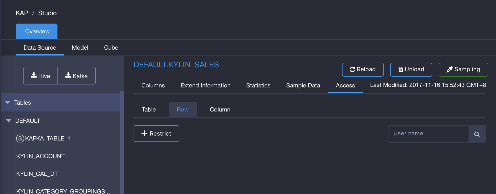
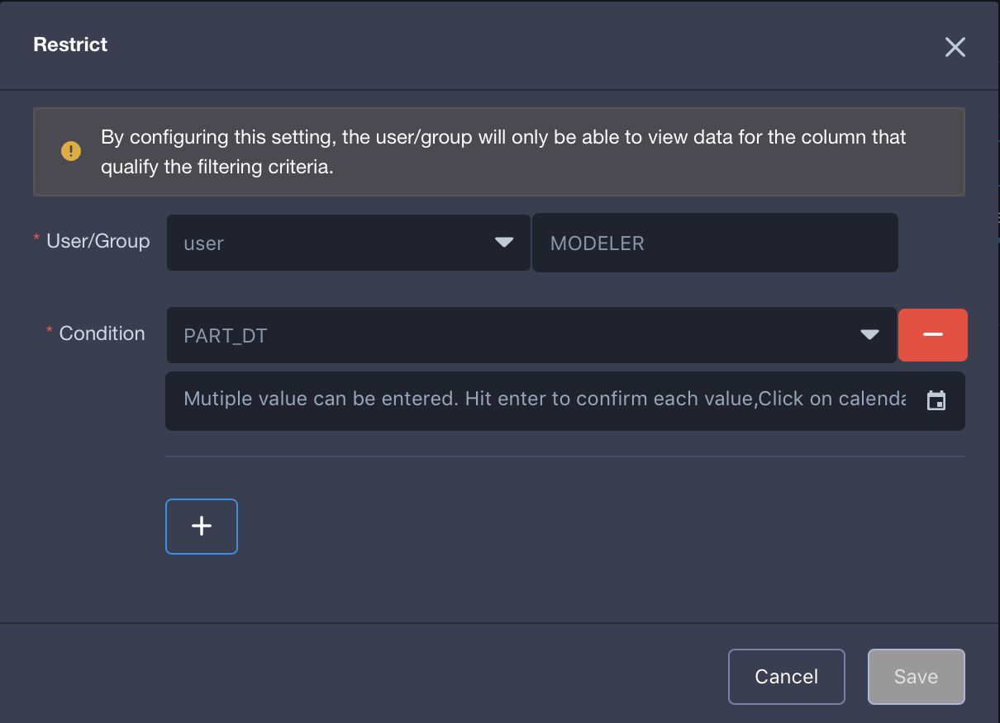

##Row-level Access Control

**Row-level Access Control** restrict a user/group's access to a table without having access to all rows on that table. This type of access control is typically applied to tables that hold sensitive data. For example, you might want sales manager to be able to view sales data in their region, but not for other regions. You would give sales manager in North East Region access to Sales table but would restrict row-level access control so that they would only see rows where region is North East. 

If a user/group has restricted access to a row in a table, this user/group will only be able to view rows that applied in the Row-level Access Control, regardless of querying through Cube, Table Index or Query Push Down. If the user/group does not use the restricted row in the query, then row-level access control will not be applied in the query. 

When you load the table for the first time into a project or upgrade KAP from a lower version, by default, when you give users/groups QUERY access to a project in KAP, they have access to all the rows of data in the table. 

Row-level Access Control needs to be set by project basis. That means even if you load the same Hive or KAFKA table from data source twice in different projects, row-level access control needs to be set independently for those two projects. 

### Manage Row-level Access Control

#### Add Restriction

Follow below steps to add restrictions at table-level:

1. Go to `Studio` on the left hand side navigation bar.
2. Go to `Data Source`, click on a loaded table.
3. For that table, click `Access` tab, choose `Row`. 
4. Click `+Restrict` to restrict access to user/group. 
5. On the pop-up window, choose the user/group.
6. Choose the column and type in the filtering value. Hit enter to confirm your input. You may input several values to filter.  
7. (Optional) Click on `+` to add another column to filter. 
8. Click `Save`.

The row-level restriction will transform into a where clause that append on user/group's query. If there are multiple values/groups filtered for the same column, the logical operator between these values are `OR`.  You may also set multiple row-level restriction at the same time for a user/group, the logical operator between row-level restriction on two columns will be `AND`.

You may preview the where clause for row-level restriction by clicking on the `Preview` hyperlink on the pop-up window. 

 

#### Modify Access

Follow below steps to revoke access at row-level:

1. Go to `Studio` on the left side navigation bar.
2. Go to `Data Source`, click on a loaded table.
3. For that table, click `Access` tab, choose `Row`. 
4. Under `Action`, click the `Modify` button.
5. Add or Remove row-level restriction as you want.
6. Click `Save`.

#### Revoke Access

Follow below steps to revoke access at row-level:

1. Go to `Studio` on the left side navigation bar.
2. Go to `Data Source`, click on a loaded table.
3. For that table, click `Access` tab, choose table. 
4. Under `Action`, click the `Delete` button.

####Validate Row-level Access Control

In this example, we take the user `joanna` as an example to validate the row-level access control. The validation of row-level access control for a group is the similar.  User `joanna` is a user who has access to `learn_kylin ` project and can only access to data with `OPS_REGION` is 'Shanghai'.

Login as user `joanna`, go to `Insight` page, and try to query row `OPS_REGION` to validate whether row-level access control has been effective.

As shown in the screenshot below,  user `joanna` can only view records in `Kylin_sales` with `OPS_REGION` of 'Shanghai'.

