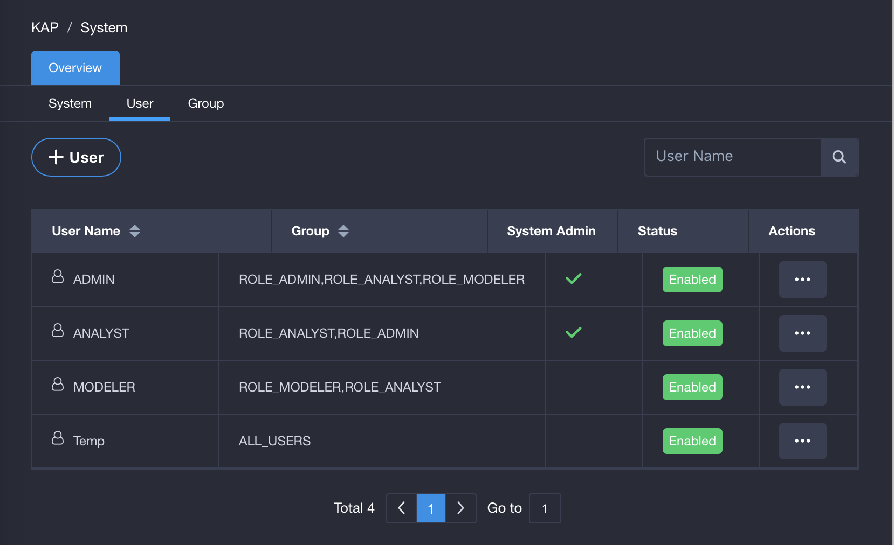
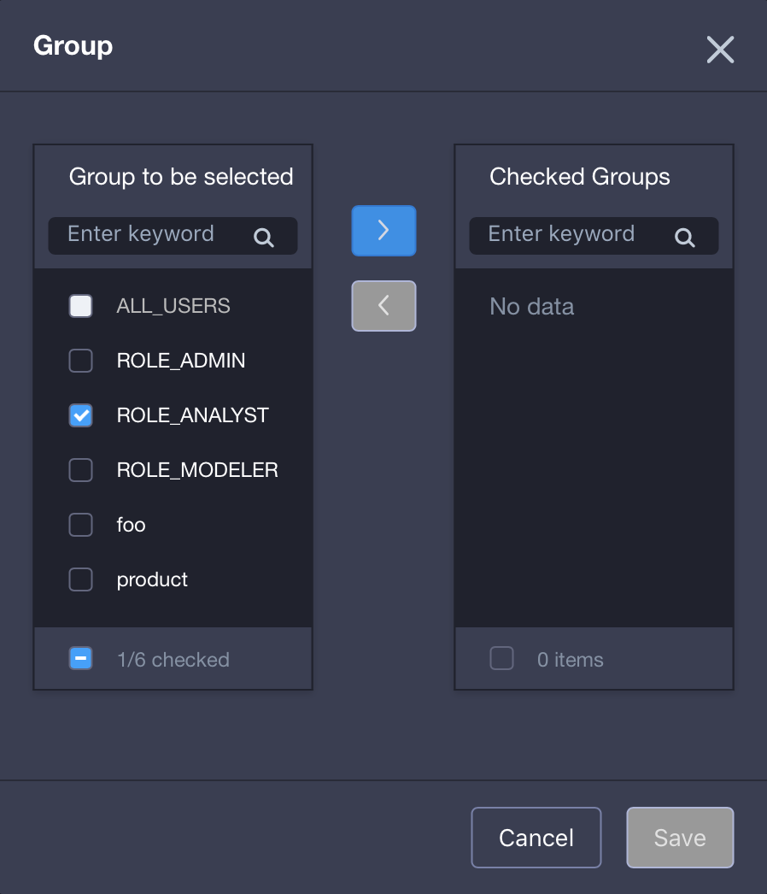
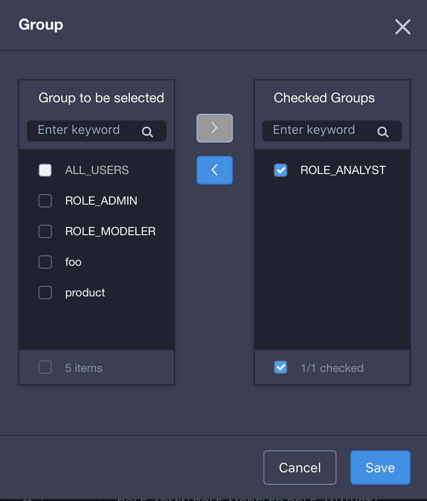

## User Management

This section provides an overview of what a user is and how a user can be managed. 

###About User

To use KAP, a user must log in to the system using a login ID and password. Users are defined in the KAP metadata and exist across projects. You do not have to define users for every project you create in a single metadata. 

User **ADMIN** is a built in default user with system admin access permission created with a new KAP metadata. **System admin** user has all access permission for all projects. 

###Access Control List
The **Access Control List (ACL)** is a list of user and access permission that user has in a project. Except for system admin, ACL needs to be granted on a project basis. 

There are fours types of access permission on a project in KAP. They are PROJECT ADMIN, MANAGEMENT, OPERATION, and QUERY. Each access permission defines a list of functionality user may perform in KAP system. 

For details on project-level access control and how to grant access on project, please refer to [Manage Access Permission](acl.en.md) 

###Manage User

Login to KAP and click `system ` button on the navigation bar. The system management page will then show. Next, click `User` bar on the left side to enter user management page. Only system admin could get access to the user management page. 

There are three default users in KAP: ADMIN (system admin), MODELER and ANALYST.

Once a user is created, the system admin can add, manage, delete and group users on user management page. 

Except for System Admin, Other users need to be granted access permission on project-level in order to use any functionality in KAP. Creating user alone will not grant users any access permission. 

#### Add User
Under user management page, click `+ User` button to create a new user, type in a user name and input new password twice, and then set whether this user is the system admin. Click on `Yes` to create the new user. 

#### Edit User
Under user management page, click `…` under `Action`, and choose `Edit User`. 

System admin will be prompted to set or unset this user to be system admin on this page. 

#### Reset Password
Under user management page, click `…` under `Action`, and choose `reset password`.

System admin needs to type in the new password twice to reset the password. 

User will be prompted to change password at first login. If you want to reset password to the default for user ADMIN, please execute command (kylin.sh admin-password-reset) in the KYLIN_HOME.

#### Drop User

Under user management page, click `…` under `Action`, and choose `Drop`.

System admin could delete users within the page. Please be noted that dropped users cannot be restored. 

When use is dropped from KAP instance entirely, all user's access permission on all projects will be dropped subsequently. This may include project-level, table-level, row-level and column-level access permission if there is any. 

#### Enable/Disable Users
Under user management page, click `…` under `Action`, and choose `Disable` or `Enable`.

System admin could enable or disable users and disabled users cannot login to the system. 

#### Change Password as Normal Users
Click the `User Name` on the top right corner of the navigation bar, then users could choose the `Settings` option and be prompted to reset password. User needs to provide the old password and enter a new password twice to reset the password.

#### Group Users

To add a user to a specific group, do the following:

1. Under user management page, select a user to be grouped.
2. Click `…` under `Action`, and choose `Group Membership`.
3. Select a group to assign the user to under `Group to be selected`, and then click the right arrow. The group will enter `Checked Group`.
4. Click `Save` and the user will be in the selected group.

#### Modify User's Group

To modify user's group, do the following:

1. Under user management page, select the user to modify the group.
2. Click `…` under `Action`, and choose `Group Membership`.
3. Select the group to be modified under `Checked Group`, and then click the left arrow. The group will enter into `Group to be selected`.
4. Click `Save` and the user's group will be modified.

#### User Management when LDAP Enabled

Once LDAP is enabled, user is read-only and cannot be added, edited, dropped, modified or grouped.

For more information on LDAP, please see [LDAP Authentication](security/ldap.en.md) in this chapter.