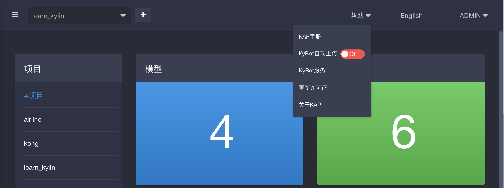
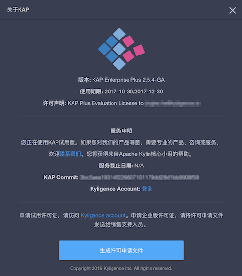

## 许可证申请

许可证是使用 KAP 的必要条件。在安装和部署完 KAP 之后，需要申请许可证，才能使用 KAP。在 KAP 产品中，许可证分为 KAP 许可证、KAP Plus 许可证和 KyBot 许可证。KAP 及 KAP Plus 的许可证有试用许可证（试用期限均为两个月）和正式许可证。KyBot 在线服务分基础版、标准版和专业版三种，标准版是免费的，专业版提供更多的服务和 SLA 支持。KAP 与 KAP Plus 的许可证不同，因此申请流程也稍有差别。下面将详细介绍 KAP 及 KAP Plus 许可证的申请流程及具体操作。

### 申请流程

许可证申请流程及具体操作如下：

1. 使用帐号信息登录 [Kyligence Account Center](http://account.kyligence.io/)。如果未申请过帐号，需要先注册。如果已经注册，使用注册的帐号信息登录。

2. 登录后，选择要申请的许可证 **KAP Plus** 或 **KAP**。如果要申请 KAP 试用许可证，直接点击**下载试用许可证**即可。如果要申请 KAP Plus 试用许可证，需要先填写一张表，申请通过后，您会收到一封系统发来的通知邮件。这时，可以登录 [Kyligence Account Center](http://account.kyligence.io/)，点击**下载试用许可证**。

3. 如果需要购买 KAP Plus 或 KAP 的正式许可证，可在试用 KAP Plus 或 KAP 的过程中，点击**帮助 -> 关于KAP**。

然后点击**生成许可申请文件**，后续将有相关销售人员跟进申请。

