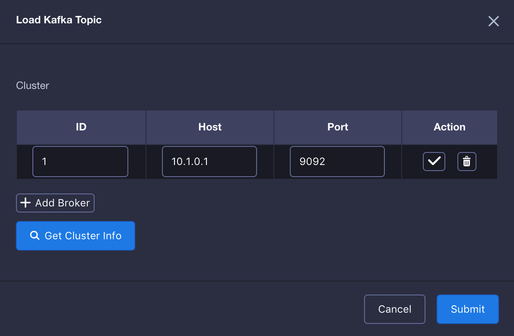

## 导入Kafka数据源
本节介绍如何导入 Kafka 数据源，以及从流式数据定义事实表。

### 环境准备

在开始本教程前，请确保您已准备好Hadoop环境并且已经安装了**KAP 2.3**及以上版本和**Kafka v2.10-0.10.1.0**及以上版本。在本教程中，我们使用Hortonworks HDP 2.4 Sandbox虚拟机作为Hadoop环境。

Kafka Broker无需与KAP部署在同一个节点上，如果KAP节点上没有部署Kafka Broker，建议将相同版本的Kafka二进制包复制并解压在KAP启动节点上的任意路径（如/usr/local/kafka_2.10-0.10.1.0），并设置KAFKA_HOME指向该路径，确保KAFKA_HOME/libs 目录下有Kafka的客户端library。

以下例子假设用户没有安装过Kafka Broker，包含了Kafka Broker部署到本机，以及启动的过程，对于已经安装过Kafka Broker的用户该步骤可以省略。

```shell
curl -s https://archive.apache.org/dist/kafka/0.10.1.0/kafka_2.10-0.10.1.0.tgz | tar -xz -C /usr/local/
cd /usr/local/kafka_2.10-0.10.1.0/
./bin/kafka-server-start.sh config/server.properties &
```

务必确保KAP启动前，已经将*KAFKA_HOME*变量正确导出。

```shell
export KAFKA_HOME=/usr/local/kafka_2.10-0.10.1.0
```

### 创建Kafka Topic并模拟流数据（可选）

> 提示：该创建Topic步骤为可选，用户如果已经有了Kafka Topic可以忽略这个步骤。
>
> 以下例子假设Kafka Broker运行在127.0.0.1:9092，ZooKeeper运行在127.0.0.1:2181，用户在自己环境中请自行更新IP地址。

首先，我们创建一个名为"kylin_demo"的topic。

```shell
./bin/kafka-topics.sh --create --zookeeper 127.0.0.1:2181 --replication-factor 1 --partitions 3 --topic kylindemo
```

接着，我们需要启动一个生产者，持续往topic中导入数据。KAP提供了一个简单的Producer用于产生数据。这里假设KAP安装在${KYLIN_HOME}目录。

```shell
cd $KYLIN_HOME
./bin/kylin.sh org.apache.kylin.source.kafka.util.KafkaSampleProducer --topic kylindemo --broker 127.0.0.1:9092
```
这个工具类每秒会向Kafka中发送100条消息。在学习本教程的过程中，请保持本程序持续运行。同时，你可以使用Kafka自带的消费者控制台来检查消息是否成功导入。

```shell
cd $KAFKA_HOME
bin/kafka-console-consumer.sh --bootstrap-server 127.0.0.1:9092 --topic kylindemo --from-beginning
```

### 从流式数据中定义事实表

1. 启动KAP, 登录KAP web GUI, 新建一个project或者选择一个已有的project。点击 "Studio" -> "Data Source"，点击"Kafka"按钮。
   
2. 输入Broker集群信息，注意：这里Host要填写实际IP地址，是YARN集群上运行的Job可以访问的地址。
   


3. 点击 √ 确认Broker后，点击 Get Cluster Info -> sandbox -> kylindemo, Kafka的采样消息会出现在右边，点击 Convert。
   


4. 接着，您需要为流式数据源定义一个表名。定义的表名会用于后续的 SQL 查询。 假设我们将表命名为 "KAFKA_TABLE_1" 。
   

5. 检查表结构是否正确，确保至少有一列被选择为timestamp。

   

6. 设置解析器

   解析器名称: 默认为org.apache.kylin.source.kafka.TimedJsonStreamParser，您也可以自定义解析器

   时间戳字段名称: 必须为解析器指定一列用于分段的时间字段，本例选择了order_time

   解析器属性: 为解析器定义更多属性

   

7. 点击"提交"

