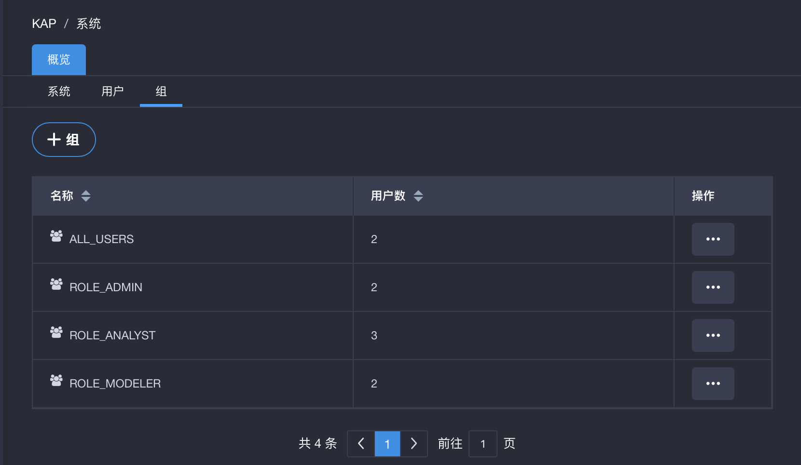
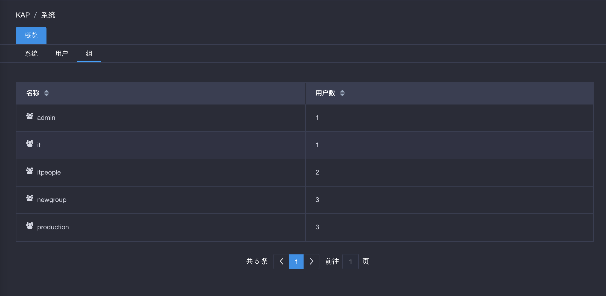

## 用户组管理

本节介绍什么是用户组以及如何管理用户组。

### 关于用户组

用户组是一组用户的集合，用户组中的用户通过用户组共享相同的访问权限。在大型组织机构／企业中，用户的权限常常以用户组为单位进行授予，方便在用户人数众多的场景下，快速对拥有相同权限的用户进行批量权限配置。

用户组中，All users 组是一个默认的用户组，用户创建后，即进入该组。也就是说，所有用户都包含在 All users 用户组中。All users 用户组不能被修改或删除。系统管理员可以对除 All users 以外的其他组，批量添加或删除用户，也可以将某个用户添加到除 All users 以外的多个组中。用户组在整个 KAP 实例中不能重名。

###关于用户组权限

系统管理员可以对用户组赋予项目级／行级／表级／列级权限。在对用户组赋予某种项目级／行级／表级／列级权限时，用户组中的用户会继承所属组的相应权限。

当用户组与用户组中的用户被同时赋予某一项目级／行级／表级／列级权限时，用户的权限取两者最大权限。例如，如果用户 A 在某项目上被授予 Query 权限，用户组被授予该项目的 Management 权限，而用户 A 包含在该用户组中，则该用户具有该项目上的 Management 权限。

用户组被剥夺了某表级／行级／列级权限时，则用户组内的所有用户都将失去表／行／列的访问权限。用户组上禁止访问某表／行／列，而用户组内某用户被允许访问某表／行／列，按照限制取最大的原则，则用户禁止访问某表／行／列，反之亦然。

配置在用户及用户组上的权限会同时作用在用户的访问权限上，如用户组上禁止访问某表 A，用户组内用户禁止访问某表 B，则该用户不能访问表 A 和 B。

当某用户属于多个用户组时，该用户从不同用户组继承的项目级／表级权限／行列级权限取其中最大权限。

###管理用户组

#### 管理用户所在的用户组

在实际的企业组织结构中，一个员工可能隶属于行向、纵向的不同组织结构。也就是说，在系统中，一个用户有可能归属于多个以企业组织结构创建的用户组。如一个员工职能上属于研发部门，而按所属的产品线又属于企业级产品线。

系统管理员可以管理用户组，将某一用户批量添加到不同组中，也可从不同组中删除某用户（All users 除外）。删除用户组后，用户组内的所有用户不会被删除，但所有赋予该用户组上的权限将被删除。

#### 管理用户组中的用户

系统管理员可以批量添加或删除用户组（All users 组除外）中的用户。用户可以被添加到多个用户组中。

### 操作步骤

#### 进入用户组页面

登录 KAP 后，点击导航栏的`系统`按钮，进入系统管理页面，点击左侧的`组`进入用户组管理页面。只有系统管理员能看到该页面。KAP 默认会初始化三个用户，对应名称为 ALL_USERS、ROLE_ADMIN、ROLE_ANALYST 和 ROLE_MODELER。

用户组创建后，系统管理员可以在`系统->组`页面对用户进行管理，可以添加、删除用户组，修改用户所在组，以及为组分配用户并赋予权限。

#### 创建用户组

在`系统->组`管理页面，系统管理员可以点击`+组`按钮来添加新组。在添加新用户弹出窗口中，输入组名，按`保存`。

#### 为组分配用户
在`系统->组`管理页面，选择要向其分配用户的组，点击右侧`操作`下的`…`，，选择`分配用户`。

在弹出窗口的`未分配的用户`中勾选需要要分配的用户，点击向右箭头，该用户将进入`已分配组用户`。

#### 修改用户所在组
参见本章[管理用户](security/user.cn.md)。

#### 为组赋予权限

参见本章[管理访问权限](security/acl.cn.md)。

### 启用 LDAP 后的用户组管理

在启用 LDAP 后，用户组只能为只读，不可添加、编辑、删除、修改用户组或为用户组分配用户。

有关 LDAP 的更多信息，参见本章 [LDAP 验证](security/ldap.cn.md)。